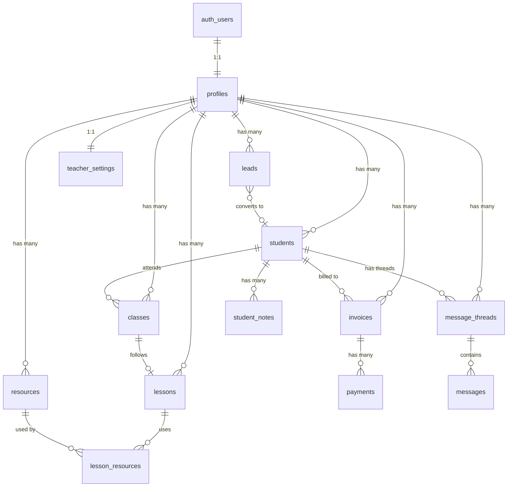

# Arquitetura do Banco de Dados — Bloom Teacher's Hub

## Visão Geral

Banco **multi-tenant por professor** — cada professor é um tenant isolado.
Isolamento garantido por **Row Level Security (RLS)** em 100% das tabelas.
Backend: **Supabase** (PostgreSQL + Auth + Storage).

---

## Estratégia de Autenticação

| Método           | Detalhes                           |
| ---------------- | ---------------------------------- |
| **Email/Senha**  | Registro com confirmação por email |
| **Google OAuth** | Login/registro com conta Google    |

### Fluxo

```
1. Usuário acessa /login ou /register
2. Frontend chama server function → server function chama Supabase Auth
3. Supabase cria registro em auth.users
4. Trigger no banco cria automaticamente registro em public.profiles
5. Session cookie retornado via server function (HTTP-only)
6. Rotas /_app/* verificam sessão no servidor (beforeLoad)
```

### Segurança

- `SUPABASE_URL` + `SUPABASE_ANON_KEY` → variáveis públicas (prefixo `VITE_`)
- `SUPABASE_SERVICE_ROLE_KEY` → **server-only**, NUNCA exposta ao frontend
- Sessões gerenciadas por cookies HTTP-only no servidor
- Google OAuth redirect URL configurada no painel Supabase

---

## Diagrama de Entidades



---

## As 17 Tabelas

### Legenda de Fases

| Fase       | Módulo              | Quando será criada                 |
| ---------- | ------------------- | ---------------------------------- |
| **Fase 1** | Login & Registro    | **Agora**                          |
| Fase 2     | Students            | Quando implementar módulo Students |
| Fase 3     | Leads               | Quando implementar módulo Leads    |
| Fase 4     | Calendar            | Quando implementar módulo Calendar |
| Fase 5     | Lessons & Resources | Quando implementar esses módulos   |
| Fase 6     | Finance             | Quando implementar módulo Finance  |
| Fase 7     | Messages            | Quando implementar módulo Messages |

---

## 🔐 FASE 1 — Auth & Perfil (criadas agora)

### Tabela 1: `profiles`

**Finalidade:** Extensão do `auth.users` com dados do professor. Criada automaticamente via trigger quando o usuário se registra.

| Coluna                 | Tipo          | Constraints                   | Descrição               |
| ---------------------- | ------------- | ----------------------------- | ----------------------- |
| `id`                   | `uuid`        | PK, FK → `auth.users.id`      | Mesmo ID do auth        |
| `full_name`            | `text`        | NOT NULL                      | Nome completo           |
| `avatar_url`           | `text`        |                               | URL do avatar           |
| `bio`                  | `text`        |                               | Apresentação breve      |
| `languages_taught`     | `text[]`      | DEFAULT `'{}'`                | Idiomas que ensina      |
| `timezone`             | `text`        | DEFAULT `'America/Sao_Paulo'` | Fuso horário            |
| `locale`               | `text`        | DEFAULT `'pt-BR'`             | Idioma da interface     |
| `onboarding_completed` | `boolean`     | DEFAULT `false`               | Completou setup inicial |
| `created_at`           | `timestamptz` | DEFAULT `now()`               |                         |
| `updated_at`           | `timestamptz` | DEFAULT `now()`               |                         |

**RLS:**

- `SELECT`: somente `auth.uid() = id`
- `UPDATE`: somente `auth.uid() = id`
- `INSERT`: bloqueado (apenas via trigger server-side)

**Acesso:** Frontend lê dados do próprio perfil. Criação é backend-only (trigger).

---

### Tabela 2: `teacher_settings`

**Finalidade:** Preferências de configuração do professor (moeda, duração de aula, branding de fatura, etc.)

| Coluna                     | Tipo          | Constraints                          | Descrição                   |
| -------------------------- | ------------- | ------------------------------------ | --------------------------- |
| `id`                       | `uuid`        | PK, DEFAULT `gen_random_uuid()`      |                             |
| `teacher_id`               | `uuid`        | FK → `profiles.id`, UNIQUE, NOT NULL |                             |
| `currency`                 | `text`        | DEFAULT `'BRL'`                      | Moeda padrão                |
| `default_class_duration`   | `integer`     | DEFAULT `60`                         | Duração em minutos          |
| `week_starts_on`           | `smallint`    | DEFAULT `1`                          | 0=Dom, 1=Seg                |
| `booking_link_slug`        | `text`        | UNIQUE                               | Slug para link público      |
| `invoice_branding`         | `jsonb`       | DEFAULT `'{}'`                       | Logo, cores, rodapé         |
| `notification_preferences` | `jsonb`       | DEFAULT `'{}'`                       | Preferências de notificação |
| `created_at`               | `timestamptz` | DEFAULT `now()`                      |                             |
| `updated_at`               | `timestamptz` | DEFAULT `now()`                      |                             |

**RLS:**

- `SELECT`: `auth.uid() = teacher_id`
- `INSERT`: `auth.uid() = teacher_id`
- `UPDATE`: `auth.uid() = teacher_id`

---

## 👩‍🎓 FASE 2 — Students

### Tabela 3: `students`

**Finalidade:** Perfil completo de cada aluno gerenciado pelo professor.

| Coluna       | Tipo          | Constraints                     | Descrição                |
| ------------ | ------------- | ------------------------------- | ------------------------ |
| `id`         | `uuid`        | PK, DEFAULT `gen_random_uuid()` |                          |
| `teacher_id` | `uuid`        | FK → `profiles.id`, NOT NULL    | Professor dono           |
| `full_name`  | `text`        | NOT NULL                        |                          |
| `email`      | `text`        |                                 |                          |
| `phone`      | `text`        |                                 | Telefone/WhatsApp        |
| `avatar_url` | `text`        |                                 |                          |
| `level`      | `text`        |                                 | CEFR: A1–C2              |
| `language`   | `text`        |                                 | Idioma que estuda        |
| `goals`      | `text`        |                                 | Objetivos do aluno       |
| `tags`       | `text[]`      | DEFAULT `'{}'`                  | Tags livres              |
| `status`     | `text`        | DEFAULT `'active'`              | active, paused, inactive |
| `started_at` | `date`        |                                 | Data de início           |
| `created_at` | `timestamptz` | DEFAULT `now()`                 |                          |
| `updated_at` | `timestamptz` | DEFAULT `now()`                 |                          |

**RLS (todas as operações):** `auth.uid() = teacher_id`

---

### Tabela 4: `student_notes`

**Finalidade:** Anotações do professor sobre cada aluno.

| Coluna       | Tipo          | Constraints                          | Descrição           |
| ------------ | ------------- | ------------------------------------ | ------------------- |
| `id`         | `uuid`        | PK, DEFAULT `gen_random_uuid()`      |                     |
| `student_id` | `uuid`        | FK → `students.id` ON DELETE CASCADE |                     |
| `teacher_id` | `uuid`        | FK → `profiles.id`, NOT NULL         | Redundante para RLS |
| `content`    | `text`        | NOT NULL                             |                     |
| `created_at` | `timestamptz` | DEFAULT `now()`                      |                     |

**RLS:** `auth.uid() = teacher_id` (SELECT, INSERT, DELETE)

---

## 🎯 FASE 3 — Leads

### Tabela 5: `leads`

**Finalidade:** Pipeline de conversão de potenciais alunos.

| Coluna                 | Tipo          | Constraints                     | Descrição                                     |
| ---------------------- | ------------- | ------------------------------- | --------------------------------------------- |
| `id`                   | `uuid`        | PK, DEFAULT `gen_random_uuid()` |                                               |
| `teacher_id`           | `uuid`        | FK → `profiles.id`, NOT NULL    |                                               |
| `full_name`            | `text`        | NOT NULL                        |                                               |
| `email`                | `text`        |                                 |                                               |
| `phone`                | `text`        |                                 |                                               |
| `source`               | `text`        |                                 | instagram, whatsapp, website, referral, other |
| `stage`                | `text`        | DEFAULT `'new'`                 | new, contacted, trial, won, lost              |
| `notes`                | `text`        |                                 |                                               |
| `converted_student_id` | `uuid`        | FK → `students.id`              | Preenchido ao converter                       |
| `created_at`           | `timestamptz` | DEFAULT `now()`                 |                                               |
| `updated_at`           | `timestamptz` | DEFAULT `now()`                 |                                               |

**RLS (todas as operações):** `auth.uid() = teacher_id`

---

## 📅 FASE 4 — Calendar

### Tabela 6: `classes`

**Finalidade:** Cada aula agendada (individual ou em grupo).

| Coluna                 | Tipo          | Constraints                     | Descrição                                |
| ---------------------- | ------------- | ------------------------------- | ---------------------------------------- |
| `id`                   | `uuid`        | PK, DEFAULT `gen_random_uuid()` |                                          |
| `teacher_id`           | `uuid`        | FK → `profiles.id`, NOT NULL    |                                          |
| `student_id`           | `uuid`        | FK → `students.id`              | NULL para aulas em grupo                 |
| `lesson_id`            | `uuid`        | FK → `lessons.id`               | Plano de aula usado                      |
| `title`                | `text`        | NOT NULL                        |                                          |
| `description`          | `text`        |                                 |                                          |
| `starts_at`            | `timestamptz` | NOT NULL                        | Início                                   |
| `ends_at`              | `timestamptz` | NOT NULL                        | Fim                                      |
| `mode`                 | `text`        | DEFAULT `'online'`              | online, in_person                        |
| `meeting_url`          | `text`        |                                 | Link Zoom/Meet                           |
| `location`             | `text`        |                                 | Endereço presencial                      |
| `status`               | `text`        | DEFAULT `'scheduled'`           | scheduled, completed, cancelled, no_show |
| `recurrence_rule`      | `text`        |                                 | RRULE (RFC 5545)                         |
| `recurrence_parent_id` | `uuid`        | FK → `classes.id`               | Aula-mãe da recorrência                  |
| `created_at`           | `timestamptz` | DEFAULT `now()`                 |                                          |
| `updated_at`           | `timestamptz` | DEFAULT `now()`                 |                                          |

**RLS (todas as operações):** `auth.uid() = teacher_id`

---

### Tabela 7: `class_students`

**Finalidade:** Junção N:N para aulas em grupo + controle de presença.

| Coluna       | Tipo   | Constraints                          | Descrição                |
| ------------ | ------ | ------------------------------------ | ------------------------ |
| `class_id`   | `uuid` | FK → `classes.id` ON DELETE CASCADE  |                          |
| `student_id` | `uuid` | FK → `students.id` ON DELETE CASCADE |                          |
| `teacher_id` | `uuid` | FK → `profiles.id`, NOT NULL         | Para RLS                 |
| `attendance` | `text` | DEFAULT `'pending'`                  | pending, present, absent |

**PK:** `(class_id, student_id)`
**RLS:** `auth.uid() = teacher_id` (SELECT, INSERT, UPDATE)

---

## 📚 FASE 5 — Lessons & Resources

### Tabela 8: `lessons`

**Finalidade:** Planos de aula reutilizáveis.

| Coluna             | Tipo          | Constraints                     | Descrição               |
| ------------------ | ------------- | ------------------------------- | ----------------------- |
| `id`               | `uuid`        | PK, DEFAULT `gen_random_uuid()` |                         |
| `teacher_id`       | `uuid`        | FK → `profiles.id`, NOT NULL    |                         |
| `title`            | `text`        | NOT NULL                        |                         |
| `description`      | `text`        |                                 |                         |
| `level`            | `text`        |                                 | CEFR                    |
| `language`         | `text`        |                                 | Idioma-alvo             |
| `skill_focus`      | `text[]`      | DEFAULT `'{}'`                  | speaking, writing, etc. |
| `content`          | `jsonb`       | DEFAULT `'{}'`                  | Estrutura da aula       |
| `duration_minutes` | `integer`     |                                 | Duração estimada        |
| `is_template`      | `boolean`     | DEFAULT `false`                 | Template reutilizável   |
| `tags`             | `text[]`      | DEFAULT `'{}'`                  |                         |
| `created_at`       | `timestamptz` | DEFAULT `now()`                 |                         |
| `updated_at`       | `timestamptz` | DEFAULT `now()`                 |                         |

**RLS (todas as operações):** `auth.uid() = teacher_id`

---

### Tabela 9: `resources`

**Finalidade:** Biblioteca de materiais didáticos (PDFs, áudios, slides).

| Coluna            | Tipo          | Constraints                     | Descrição                     |
| ----------------- | ------------- | ------------------------------- | ----------------------------- |
| `id`              | `uuid`        | PK, DEFAULT `gen_random_uuid()` |                               |
| `teacher_id`      | `uuid`        | FK → `profiles.id`, NOT NULL    |                               |
| `title`           | `text`        | NOT NULL                        |                               |
| `description`     | `text`        |                                 |                               |
| `file_url`        | `text`        |                                 | URL no Supabase Storage       |
| `file_type`       | `text`        |                                 | pdf, image, audio, video, doc |
| `file_size_bytes` | `bigint`      |                                 |                               |
| `level`           | `text`        |                                 | CEFR                          |
| `language`        | `text`        |                                 |                               |
| `tags`            | `text[]`      | DEFAULT `'{}'`                  |                               |
| `folder`          | `text`        |                                 | Organização por pastas        |
| `is_public`       | `boolean`     | DEFAULT `false`                 | Visível no marketplace        |
| `created_at`      | `timestamptz` | DEFAULT `now()`                 |                               |
| `updated_at`      | `timestamptz` | DEFAULT `now()`                 |                               |

**RLS:**

- `SELECT`: `auth.uid() = teacher_id` **OU** `is_public = true`
- `INSERT / UPDATE / DELETE`: `auth.uid() = teacher_id`

---

### Tabela 10: `lesson_resources`

**Finalidade:** Junção N:N entre lessons e resources.

| Coluna        | Tipo   | Constraints                           | Descrição |
| ------------- | ------ | ------------------------------------- | --------- |
| `lesson_id`   | `uuid` | FK → `lessons.id` ON DELETE CASCADE   |           |
| `resource_id` | `uuid` | FK → `resources.id` ON DELETE CASCADE |           |
| `teacher_id`  | `uuid` | FK → `profiles.id`, NOT NULL          | Para RLS  |

**PK:** `(lesson_id, resource_id)`
**RLS:** `auth.uid() = teacher_id`

---

## 💰 FASE 6 — Finance

### Tabela 11: `invoices`

**Finalidade:** Faturas geradas pelo professor para seus alunos.

| Coluna           | Tipo          | Constraints                     | Descrição                             |
| ---------------- | ------------- | ------------------------------- | ------------------------------------- |
| `id`             | `uuid`        | PK, DEFAULT `gen_random_uuid()` |                                       |
| `teacher_id`     | `uuid`        | FK → `profiles.id`, NOT NULL    |                                       |
| `student_id`     | `uuid`        | FK → `students.id`, NOT NULL    |                                       |
| `invoice_number` | `text`        |                                 | Número sequencial por professor       |
| `description`    | `text`        |                                 |                                       |
| `amount_cents`   | `integer`     | NOT NULL                        | Valor em centavos                     |
| `currency`       | `text`        | DEFAULT `'BRL'`                 |                                       |
| `status`         | `text`        | DEFAULT `'draft'`               | draft, sent, paid, overdue, cancelled |
| `due_date`       | `date`        |                                 | Vencimento                            |
| `paid_at`        | `timestamptz` |                                 | Data do pagamento                     |
| `line_items`     | `jsonb`       | DEFAULT `'[]'`                  | Itens da fatura                       |
| `created_at`     | `timestamptz` | DEFAULT `now()`                 |                                       |
| `updated_at`     | `timestamptz` | DEFAULT `now()`                 |                                       |

**RLS:** `auth.uid() = teacher_id` (SELECT, INSERT, UPDATE)

---

### Tabela 12: `payments`

**Finalidade:** Registros de pagamentos recebidos. Operações de gateway (Stripe/MP) são **backend-only**.

| Coluna         | Tipo          | Constraints                     | Descrição                        |
| -------------- | ------------- | ------------------------------- | -------------------------------- |
| `id`           | `uuid`        | PK, DEFAULT `gen_random_uuid()` |                                  |
| `teacher_id`   | `uuid`        | FK → `profiles.id`, NOT NULL    |                                  |
| `invoice_id`   | `uuid`        | FK → `invoices.id`              |                                  |
| `amount_cents` | `integer`     | NOT NULL                        |                                  |
| `currency`     | `text`        | DEFAULT `'BRL'`                 |                                  |
| `method`       | `text`        |                                 | pix, card, cash, transfer, other |
| `external_id`  | `text`        |                                 | ID do gateway                    |
| `received_at`  | `timestamptz` | DEFAULT `now()`                 |                                  |
| `created_at`   | `timestamptz` | DEFAULT `now()`                 |                                  |

**RLS:** `auth.uid() = teacher_id` (SELECT, INSERT)
**Backend-only:** Processamento de webhooks de pagamento e criação via gateway.

---

## 💬 FASE 7 — Messages

### Tabela 13: `message_threads`

**Finalidade:** Conversas entre professor e aluno, ou anúncios.

| Coluna            | Tipo          | Constraints                     | Descrição          |
| ----------------- | ------------- | ------------------------------- | ------------------ |
| `id`              | `uuid`        | PK, DEFAULT `gen_random_uuid()` |                    |
| `teacher_id`      | `uuid`        | FK → `profiles.id`, NOT NULL    |                    |
| `student_id`      | `uuid`        | FK → `students.id`              | NULL para anúncios |
| `subject`         | `text`        |                                 |                    |
| `is_announcement` | `boolean`     | DEFAULT `false`                 |                    |
| `last_message_at` | `timestamptz` |                                 | Para ordenação     |
| `created_at`      | `timestamptz` | DEFAULT `now()`                 |                    |

**RLS:** `auth.uid() = teacher_id` (SELECT, INSERT)

---

### Tabela 14: `messages`

**Finalidade:** Mensagens individuais dentro de uma thread.

| Coluna        | Tipo          | Constraints                                 | Descrição                |
| ------------- | ------------- | ------------------------------------------- | ------------------------ |
| `id`          | `uuid`        | PK, DEFAULT `gen_random_uuid()`             |                          |
| `thread_id`   | `uuid`        | FK → `message_threads.id` ON DELETE CASCADE |                          |
| `teacher_id`  | `uuid`        | FK → `profiles.id`, NOT NULL                | Para RLS                 |
| `sender_type` | `text`        | NOT NULL                                    | teacher, student, system |
| `content`     | `text`        | NOT NULL                                    |                          |
| `attachments` | `jsonb`       | DEFAULT `'[]'`                              | URLs de arquivos         |
| `read_at`     | `timestamptz` |                                             |                          |
| `created_at`  | `timestamptz` | DEFAULT `now()`                             |                          |

**RLS:** `auth.uid() = teacher_id` (SELECT, INSERT)

---

## Tabelas de suporte (não contadas separadamente)

As tabelas de junção (`class_students`, `lesson_resources`) e tabelas auxiliares (`student_notes`) estão listadas dentro de suas respectivas fases acima, totalizando **17 tabelas** incluindo essas.

Resumo: `profiles` + `teacher_settings` + `students` + `student_notes` + `leads` + `classes` + `class_students` + `lessons` + `resources` + `lesson_resources` + `invoices` + `payments` + `message_threads` + `messages` = **14 tabelas principais + 3 de junção/suporte = 17 total**.

---

## Triggers

### Criar perfil no registro (Fase 1)

```sql
CREATE OR REPLACE FUNCTION public.handle_new_user()
RETURNS trigger AS $$
BEGIN
  INSERT INTO public.profiles (id, full_name, avatar_url)
  VALUES (
    NEW.id,
    COALESCE(NEW.raw_user_meta_data ->> 'full_name', NEW.raw_user_meta_data ->> 'name', ''),
    COALESCE(NEW.raw_user_meta_data ->> 'avatar_url', NEW.raw_user_meta_data ->> 'picture', '')
  );
  RETURN NEW;
END;
$$ LANGUAGE plpgsql SECURITY DEFINER;

CREATE TRIGGER on_auth_user_created
  AFTER INSERT ON auth.users
  FOR EACH ROW
  EXECUTE FUNCTION public.handle_new_user();
```

### Auto-atualizar `updated_at`

```sql
CREATE OR REPLACE FUNCTION public.set_updated_at()
RETURNS trigger AS $$
BEGIN
  NEW.updated_at = now();
  RETURN NEW;
END;
$$ LANGUAGE plpgsql;

-- Aplicar em: profiles, teacher_settings, students, leads, classes,
--             lessons, resources, invoices
```

---

## Tabelas acessadas SOMENTE pelo backend

| Tabela                                | Motivo                                                                            |
| ------------------------------------- | --------------------------------------------------------------------------------- |
| `payments` (criação via webhook)      | Webhooks de Stripe/Mercado Pago são processados no servidor                       |
| `profiles` (INSERT)                   | Criação apenas via trigger SECURITY DEFINER                                       |
| `teacher_settings` (campos sensíveis) | `invoice_branding`, `notification_preferences` são alterados via server functions |

Todas as demais tabelas são acessadas via Supabase client com RLS ativo — o frontend usa o `anon key` e o RLS garante que cada professor só vê seus dados.

---

## Índices de Performance

| Tabela            | Índice                          | Motivo                |
| ----------------- | ------------------------------- | --------------------- |
| `students`        | `(teacher_id, status)`          | Filtrar alunos ativos |
| `leads`           | `(teacher_id, stage)`           | Pipeline kanban       |
| `classes`         | `(teacher_id, starts_at)`       | Agenda do dia/semana  |
| `classes`         | `(student_id, starts_at)`       | Histórico do aluno    |
| `invoices`        | `(teacher_id, status)`          | Faturas pendentes     |
| `invoices`        | `(student_id)`                  | Faturas por aluno     |
| `messages`        | `(thread_id, created_at)`       | Ordenação cronológica |
| `message_threads` | `(teacher_id, last_message_at)` | Lista de conversas    |
| `resources`       | `(teacher_id, folder)`          | Navegação por pastas  |

---

## Supabase Storage Buckets

| Bucket      | Acesso            | Uso                 |
| ----------- | ----------------- | ------------------- |
| `avatars`   | Público (leitura) | Fotos de perfil     |
| `resources` | Privado (RLS)     | Materiais didáticos |
| `invoices`  | Privado (RLS)     | PDFs de faturas     |
